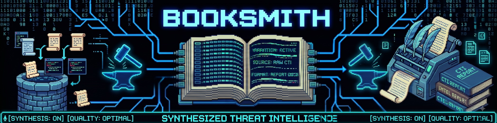

# Booksmith — Automated Book Pipeline

## Overview

Booksmith is a fully automated book creation pipeline that transforms five comprehensive [research reports](https://github.com/akinteldev/research) into a polished manuscript. The pipeline handles planning, drafting, review, supplementary writing, and final assembly — with mandatory human approval after planning, then intervention only if chapter self-review finds unresolved critical issues.

**Domain:** Cybersecurity Non-Fiction (Narrative Style)
**Author Voice:** Veteran investigative journalist ("Information, not ammunition"; calm alarm, translation over sensationalism)

## Architecture

The pipeline is managed by a **[Hermes](https://hermes-agent.nousresearch.com/) Skill** that orchestrates work through a **Kanban board**. All phases are queued as linked tasks on the `booksmith` Kanban board — the dispatcher executes them sequentially via parent-child dependencies, giving full visibility into every phase.

### How It Works

```
You invoke skill → Phase 0 creates directory + queues all Kanban tasks → 
Dispatcher picks up T1 (creator) → blocks for planning approval → you unblock → auto-promotes T2 (creator) → 
Drafts chapters, blocks if flagged → you unblock via /unblock → T3/T4/T5 execute automatically
```

**Key principles:**
- **Kanban-driven, not hidden delegation.** Every phase is a visible task on the board. No invisible `delegate_task` calls — you can see exactly what's running, stuck, or done at any time.
- **Parent-child linking enforces sequence.** T2 waits for T1 to complete; T3 waits for T2; and so on. The dispatcher auto-promotes children when parents finish (polls every ~60s).
- **Human-in-the-loop via blocking.** Phase 1 blocks for mandatory planning approval. Phase 2 only blocks if self-review leaves unresolved critical issues after one automatic revision pass. You provide feedback via `/unblock <task_id>` and execution resumes.

**More here:**
- [Booksmith Hands-On Operator Guide](docs/booksmith-hands-on-operator-guide.md) — how to invoke, monitor, approve, pause, and intervene during real runs.
- [Booksmith Tabletop Dry Run](docs/booksmith-tabletop-dry-run.md) — a timeline of what you do, what Hermes does, and what the model does.

### Prerequisites

Before running the pipeline:

1. **Hermes Profiles** must exist and be configured with your chosen models:
   - `booksmith-creator` (Opus/frontier model for planning, drafting, and logues)
   - `booksmith-reviewer` (Sonnet/strong reviewer model for manuscript review)

**Note:** Model selections are managed by Hermes Profiles, not in `config.yaml`. Edit profile settings via `hermes -p <profile-name> model` or the profile config files. You can switch models per-profile at any time without touching the pipeline logic.
   ```bash
   booksmith-creator gateway start
   booksmith-reviewer gateway start
   ```
3. **Git repository** at `/home/emkay/projects/booksmith/` with remote configured (`origin`).

### Workflow Phases (Kanban Tasks)

| Task | Title | Assignee | Description |
|------|-------|----------|-------------|
| T1 | Phase 1: Planning | booksmith-creator | Analyze reports → generate Book Bible + Chapter Prompts with per-chapter Required Source Files, then block for human approval |
| T2 | Phase 2: Drafting | booksmith-creator | Serial chapter drafts only from required source files, with source-use notes and self-review. Does not draft logues. Blocks if chapters need human review. |
| T3 | Phase 3: Manuscript Review | booksmith-reviewer | Full manuscript review for pacing, continuity, redundancy, and structural readiness for logues. Blocks before Phase 4 if major chapter fixes are needed. |
| T4 | Phase 4: Logues Writing | booksmith-creator | Foreword, intro, prologue, epilogue, glossary (configurable) |
| T5 | Phase 5: Finalizing | default | Stitch all parts into final manuscript, commit & push |

**Human intervention points:**
- **Phase 0:** You place your 5 research reports in the created `reports/` folder and reply "ready"
- **Phase 1 Review Gate:** You review the Book Bible, chapter prompts, chapter sequence, report mapping, and Required Source Files before drafting begins. Approve or provide corrections, then unblock with `/unblock <task_id>`.
- **Phase 2b (Review Gate):** If chapters are flagged during self-review, Phase 2 blocks itself. You review via Telegram and unblock with `/unblock <task_id>` after providing feedback. Timeout: 3 days → auto-fixes applied if no response.

## Models Used

| Phase | Model | Role |
|-------|-------|------|
| Planning | Creator profile (Opus/frontier) | Outline, book bible, chapter prompts |
| Drafting | Creator profile (Opus/frontier) | Chapter drafts (primary generation) |
| Self-Review | Creator profile | Per-chapter quality gate and automatic fix pass |
| Manuscript Review | Reviewer profile (Sonnet/strong reviewer) | Full manuscript review |
| Logues | Creator profile (Opus/frontier) | Supplementary material |

## Estimated Cost

~$55–70 per book (drafting dominates at ~85% of cost). Prompt caching can reduce this by 30-50%.

**Test runs:** Validate the pipeline with local models and shorter reports before committing to frontier model costs. See `references/test-run-strategy.md`.

## Directory Structure

```
booksmith/                          ← project root (git-tracked)
├── config.yaml                     ← pipeline configuration
├── README.md                       ← this file
├── .gitignore                      ← git ignore rules
├── templates/                      ← prompt templates used by the Skill
│   ├── book_bible_template.md      ← Phase 1 output template
│   ├── chapter_prompt_template.md  ← per-chapter prompt template
│   ├── self_review_template.md     ← Phase 2 quality gate checklist
│   ├── manuscript_review_template.md← Phase 3 full review format
│   └── logues_template.md          ← Phase 4 supplementary writing guide
├── books/                          ← per-book monorepo subdirectories
│   └── <book-name>/                ← each book's working directory
│       ├── reports/                ← Your 5 research reports go here
│       ├── planning/               ← Phase 1 output (bible, prompts)
│       ├── chapters/               ← Phase 2 output (drafts, source-use notes, self-reviews)
│       ├── review/                 ← Phase 3 output (manuscript review)
│       ├── logues/                 ← Phase 4 output (foreword, intro, etc.)
│       └── manuscript/             ← Phase 5 output (final stitched book)
├── logs/                           ← execution logs per run
└── SKILL.md                        ← pipeline orchestration instructions
```

## Usage Guide

### Starting a New Book

1. **Start gateways** (if not already running):
   ```bash
   booksmith-creator gateway start
   booksmith-reviewer gateway start
   ```

2. **Invoke the skill:** Send "run booksmith for <book-name>" via Telegram. The book name is normalized to lowercase-hyphens (e.g., "Zero Trust" → `zero-trust`).

3. **Phase 0 runs automatically:**
   - Creates `books/<book-name>/` with all subdirectories + `.gitkeep` files
   - Commits the empty structure to Git
   - Notifies you: "Directory created at `books/<book-name>/reports/`. Drop your 5 research reports there and reply 'ready' when done."

4. **Place your reports:** Copy/move your 5 research report markdown files into `books/<book-name>/reports/`

5. **Reply "ready"** to confirm. Phase 0 verifies the 5 files exist, then creates all 5 Kanban tasks with parent-child linking and queues them on the board.

6. **Monitor progress:** The dispatcher picks up T1 automatically. Watch the `booksmith` Kanban board as each task moves from `todo` → `ready` → `done`.

### Monitoring & Control

- **View board status:** `hermes kanban --board booksmith list --json`
- **Inspect a task:** `hermes kanban show <task_id>` (e.g., `t_f40b7340`)
- **Unblock at review gate:** `/unblock <task_id>` after providing feedback on flagged chapters
- **Reclaim stuck tasks:** If a worker crashes, use `hermes kanban reclaim <task_id>` to reset it

### Reusing the Kanban Board

The `booksmith` board is persistent and reused across book projects. When starting a new book:
1. Old completed tasks are archived automatically in Phase 0
2. New tasks T1–T5 are created fresh for the new book
3. The board accumulates history — archive old books periodically with `hermes kanban --board booksmith archive <task_ids...>`

## Configuration

Edit `config.yaml` to customize:
*   GitHub repo URL
*   Which logues to generate (`logues_included`)
*   Pipeline behavior (serial drafting, review timeout days)

**Note:** Model selections are managed by Hermes Profiles, not in `config.yaml`. Edit profile settings via `hermes -p <profile-name> model` or the profile config files.

## Git Workflow

The entire `booksmith/` directory is a single git repository (monorepo). Each book lives as a subdirectory under `books/`. This means:
*   One push/pull for all books
*   Shared templates and config across books
*   Simple backup and version control

Per-book commits are made during pipeline execution:
- Phase 0: "Initialize book directory"
- Phase 2: One commit after all chapters are drafted and reviewed ("Phase 2: Draft chapters for <book-name>")
- Phase 5: "Final manuscript assembled" + push to remote

## Troubleshooting

| Problem | Solution |
|---------|----------|
| Task stuck in `todo` | Parent didn't complete, or gateway for that profile isn't running. Check with `hermes kanban show <task_id>` |
| Task assigned to unknown profile | Dispatcher silently drops tasks assigned to non-existent profiles. Verify assignee is `booksmith-creator`, `booksmith-reviewer`, or `default` |
| Gateway not responding | Start manually: `<profile-name> gateway start`. Gateways are off by default for cost control |
| Missing reports error | Phase 0 requires exactly 5 markdown files in `reports/`. Place them and reply "ready" |
| Git push fails | Check remote is configured correctly (`git remote -v`) |
